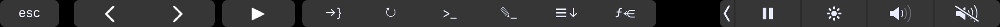

# vscode-touchbar

Basic experiment to create VS Code extention for MacBook Pro's touch bar

## Features

The extention adds the following commands to your MacBook Pro's Touch Bar in Visual Studio Code:

## Extension Settings

This extension contributes the following settings:

* `touchBar.jumpToBracket`: Jump to matching bracket.
* `touchBar.gitSync`: Git sync: performs a git pull and a git push.
* `touchBar.terminal`: Show/hide terminal window.
* `touchBar.rename`: Replace function, variable etc. name everywhere.
* `touchBar.duplicate`: Duplicate the current line below.
* `touchBar.showReferences`: List references what use the current symbol.

## Installing your extension locally
The extention is not published to the _Extention Marketplace_.
To get the extension running in all instances of VS Code, you need to copy it to a new folder under your local extensions folder: `$HOME/.vscode/extensions`

**Enjoy!**
